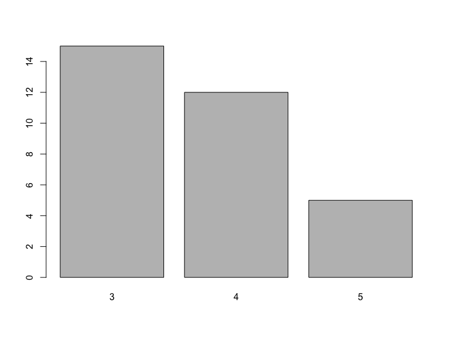

# WIRDS: Wprowadzenie do dplyr
Maciej Beręsewicz  
  

## Wprowadzenie

Celem prezentacji jest wprowadzenie do nowego pakietu [dplyr](https://github.com/hadley/dplyr). Dodatkowo poznamy potokowy sposób przetwarzania danych, który wcześniej nie był dostępny w R, a niedawno został zaimplementowany w pakiecie [magrittr](http://cran.r-project.org/web/packages/magrittr/index.html).

## Potokowe przetwarzanie danych

Załóżmy następującą sytuację: mamy dostępny zbiór danych, który przetwarzamy, a następnie na wyniku tego przetworzenia działamy dalej. 

W skrócie tę ideę możemy zapisać następująco:

dane [następnie] przetwórz [następnie] przetwórz wynik [następnie] zapisz wynik

## Przykłady potokowego przetwarzania danych

Pipeline vs metchod chaining to podejścia znane chociażby z bash (|) lub Pythona. 

Bash:
```{bash}
cd ~/Documents/Downloads/Zbiory\ danych/
ls *.txt | grep 'GT' | wc -l
  16
```

Python:

```{python}
>>> a = 'text \n\n\n'
>>> a
'text \n\n\n'
>>> a.replace('\n',' ').strip().upper()
'TEXT'
```

## Przetwarzanie potokowe w R

Przetwarzanie potokowe w R jest oprogramowane w pakiecie **magrittr**. Znajdziemy tam następujące operatory:

- %>% - operator przekazania wyników do kolejnego polecenia (czytamy: then)
- %T>% - operator przekazania obiektu do polecenia przy czym nie zwracany jest jego wynik (korzystamy do tworzenia wykresów w trakcie przetwarzania)
- %<>% - operator, który nadpisuje istniejący obiekt

Najczęściej wykorzystywanym operatorem jest %>%, który stał się "kultowy" - tworzone są koszulki [LINK](http://teespring.com/ceci-n-est-pas-une-pipe_copy_1), ciasta [LINK] czy kubki [LINK](https://twitter.com/hadleywickham/status/494875052467167232/photo/1) :)

## magrittr - przykład zastosowania (1)


```r
library(magrittr)
### podsumowanie dla jednej zmiennej
mtcars$mpg %>% summary()
```

```
##    Min. 1st Qu.  Median    Mean 3rd Qu.    Max. 
##   10.40   15.42   19.20   20.09   22.80   33.90
```

```r
### co jest równoznaczne
summary(mtcars$mpg)
```

```
##    Min. 1st Qu.  Median    Mean 3rd Qu.    Max. 
##   10.40   15.42   19.20   20.09   22.80   33.90
```

## magrittr - przykład zastosowania (2)

Stworzymy podsumowanie tabelaryczne dla zmiennej gear, a następnie wykres słupkowy.


```r
## co jest równoważne barplot(table(mtcars$gear))
mtcars$gear %>% table() %>% barplot()
```

 

## magrittr - przykład zastosowania (3)


```r
mtcars %>% sapply(.,class) %>% unique()
```

```
## [1] "numeric"
```

```r
## co jest równoważne 
unique(sapply(mtcars,class))
```

```
## [1] "numeric"
```

## 

Przejdźmy teraz do pakietu dplyr

## Informacje o pakiecie


```r
citation('dplyr')
```

```
## 
## To cite package 'dplyr' in publications use:
## 
##   Hadley Wickham and Romain Francois (2015). dplyr: A Grammar of
##   Data Manipulation. R package version 0.4.1.
##   http://CRAN.R-project.org/package=dplyr
## 
## A BibTeX entry for LaTeX users is
## 
##   @Manual{,
##     title = {dplyr: A Grammar of Data Manipulation},
##     author = {Hadley Wickham and Romain Francois},
##     year = {2015},
##     note = {R package version 0.4.1},
##     url = {http://CRAN.R-project.org/package=dplyr},
##   }
```

## dplyr: A Grammar of Data Manipulation

Pakiet zawiera implementację najważniejszych funkcji do przetwarzania danych, które ułatwiają podstawową (a również bardziej zaawansowaną) pracę z obiektami typu data.frame. Pakiet obsługuje zarówno obiekty klasy data.frame, jak również data.table. Stworzony został również obiekt klasy tbl_*, który jest "zoptymalizowany" do pracy z pakietem dplyr. Pakiet jest napisany w języku C++.

Dodatkowo pakiet zawiera:

- integrację z bazami danych (SQlite, Postgres)
- implementację tłumaczenia z i do języka SQL
- szybsze łączenie tabel 
- przetwarzanie i łączenie list

## dplyr - wprowadzenie (1)

Przyjrzyjmy się pracy w pakiecie dplyr z wykorzystaniem operatora %>%.


```r
library(dplyr)
mtcars %>%  tbl_df()
```

```
## Source: local data frame [32 x 11]
## 
##     mpg cyl  disp  hp drat    wt  qsec vs am gear carb
## 1  21.0   6 160.0 110 3.90 2.620 16.46  0  1    4    4
## 2  21.0   6 160.0 110 3.90 2.875 17.02  0  1    4    4
## 3  22.8   4 108.0  93 3.85 2.320 18.61  1  1    4    1
## 4  21.4   6 258.0 110 3.08 3.215 19.44  1  0    3    1
## 5  18.7   8 360.0 175 3.15 3.440 17.02  0  0    3    2
## 6  18.1   6 225.0 105 2.76 3.460 20.22  1  0    3    1
## 7  14.3   8 360.0 245 3.21 3.570 15.84  0  0    3    4
## 8  24.4   4 146.7  62 3.69 3.190 20.00  1  0    4    2
## 9  22.8   4 140.8  95 3.92 3.150 22.90  1  0    4    2
## 10 19.2   6 167.6 123 3.92 3.440 18.30  1  0    4    4
## ..  ... ...   ... ...  ...   ...   ... .. ..  ...  ...
```

## dplyr - wprowadzenie (2)

Podstawowe funkcje oprogramowane w pakiecie dplyr:

- select - funkcja do wybierania i usuwania kolumn z obiektu 
- rename - funkcja do zmiany nazw kolumn
- filter - funkcja do filtrowania danych
- arrange - funkcja do sortowania zbioru danych
- group_by/ungroup - funkcja do grupowania zbioru danych
- mutate - funkcja do przetwarzania zbioru danych (działania na kolumnach)
- mutate_each - funkcja do przetwarzania wielu kolumn w jedym poleceniu
- transmute - zwraca nową zmienną
- summarise - funkcja do podsumowywania zbioru danych
- summarise_each - funkcja do podsumowywania wielu zmiennych w jednym poleceniu
- do - funkcja do wykonywania działań, których wynikem nie jest jedna liczba (np. obiekt klasy lm)
- distinct - funkcja do pobierania wartości unikalnych

## Praca z dużym zbiorem danych

Popracujemy teraz ze zbioram danych z badania [Diagnoza Społeczna](www.diagnoza.com), który jest dostępny w pakiecie Diagnoza stworzonym przed dr hab. Przemysława Biecka.


```r
install.packages(devtools)
library(devtools)
install_github('pbiecek/Diagnoza')
```

Wczytamy pakiet oraz zbiór danych dot. Gospodarstw Domowych, który zapiszemy do obiektu klasy tbl_df.


```r
library(Diagnoza)
gosp <- tbl_df(gospodarstwa)
dim(gosp)
```

```
## [1] 23804  2161
```

## Wstępne przetwarzania

Aby wydajnie pracować ze zbiorem trzeba stworzyć słownik zmiennych, które zawarte są w zbiorze danych.


```r
dictionary <- gosp %>%
                attributes() %>%
                .$variable.labels %>%
                data_frame(col_name = names(.), col_label = .)
dictionary
```

```
## Source: local data frame [2,161 x 2]
## 
##               col_name                          col_label
## 1             numer_gd Numer identyfikacyjny gospodarstwa
## 2  nr_sztywny_15062013                                   
## 3          L_OSOB_2000 liczba osób w gospodarstwie w 2000
## 4          L_OSOB_2003 liczba osób w gospodarstwie w 2003
## 5          L_OSOB_2005 liczba osób w gospodarstwie w 2005
## 6          L_OSOB_2007 liczba osób w gospodarstwie w 2007
## 7          L_OSOB_2009 liczba osób w gospodarstwie w 2009
## 8          L_OSOB_2011 liczba osób w gospodarstwie w 2011
## 9          L.OSOB_2013 liczba osób w gospodarstwie w 2013
## 10        WAGA_GD_2000               Waga próby z 2000 r.
## ..                 ...                                ...
```

## Wykorzystanie funkcji select

W pierwszej kolejności nauczymy się wybierać zmienne za pomocą funkcji select. Warto zapoznać się z poniższymi funkcjami, które ułatwiają wybór kolumn:

- starts_with(x, ignore.case = TRUE): zmienne rozpoczynające się od x
- ends_with(x, ignore.case = TRUE): zmienne kończące się na x
- contains(x, ignore.case = TRUE): zmienne zawierające x
- matches(x, ignore.case = TRUE): zmienne spełniające wyrażenie regularne x
- num_range("x", 1:5, width = 2): wybiera wszystkie zmienne x kończące się na 1:5
- one_of("x", "y", "z"): zmienne, które znajdują się w wektorze znakowym
- everything(): wybiera wszystkie zmienne

Jeżeli chcemy usunąć zmienne wstawiamy przed nimi znak -

## Wykorzystanie funkcji select

Wybierzemy numer identyfikacyjny gospodarstwa (numer_gd), zmienne określjące wagę (analityczną) dla gospodarstwa domowego, zmienne dotyczące dochodu ekwiwalentnego oraz województwo.


```r
gosp_subset <- gosp %>%
                select(numer_gd, ## numer gosp
                       starts_with('WAGA'), ## waga analityczna przypisana do gospodarstwa
                       contains('ekw'),### zmienne zawierające dochód ekwiwalentny
                       contains('woje')) ### określająca województwo
gosp_subset
```

```
## Source: local data frame [23,804 x 22]
## 
##    numer_gd WAGA_GD_2000 WAGA_GD_2003 WAGA_GD_2005 WAGA_GD_2007
## 1         1    0.8441222     0.000000     0.000000    0.0000000
## 2         2    1.2796800     1.251585     1.112111    0.3304216
## 3         3    1.0427392     0.640080     0.666600    0.0000000
## 4         4    1.2796800     1.251585     1.112111    1.5144856
## 5         5    1.2796800     0.000000     0.000000    0.0000000
## 6         6    0.4910772     1.083564     1.112111    1.7968025
## 7         7    1.1785853     1.083564     1.112111    0.6655304
## 8         8    0.7591435     0.725805     0.816585    0.2238430
## 9         9    1.0264100     0.891540     1.112111    0.0000000
## 10       10    1.3996500     1.251585     0.000000    1.8356900
## ..      ...          ...          ...          ...          ...
## Variables not shown: WAGA_GD_2009 (dbl), WAGA_GD_2011 (dbl), WAGA_GD_2013
##   (dbl), WAGA_GD_2007_2009 (dbl), WAGA_GD_2007_2011 (dbl),
##   WAGA_GD_2009_2011 (dbl), WAGA_GD_2011_2013 (dbl), WAGA_GD_2009_2013
##   (dbl), adoch_m_00_ekwb (dbl), bdoch_m_00_ekwb (dbl), cdoch_m_00_ekwb
##   (dbl), ddoch_m_00_ekwb (dbl), fdoch_r_osoba_ekw (dbl), fdoch_m_osoba_ekw
##   (dbl), gdoch_r_osoba_ekw (dbl), gdoch_m_osoba_ekw (dbl), WOJEWODZTWO
##   (fctr)
```

## Wykorzystanie funkcji mutate_each

Aby dalej pracować ze zbiorem danych musimy usunąć atrybuty kolumn z wagami.


```r
gosp_subset <- gosp_subset %>%
                mutate_each(funs( ### co ma być wynikem funkcji zapisujemy w funs
                                as.numeric(.) ## funkcja, którą działamy (. = zmienna z listy)
                                ), 
                            everything()) ### wszystkie zmienne w zbiorze
```


## Wykorzystanie funkcji filter

Wybierzemy teraz tylko te gospodarstwa, uczestniczyły w badaniu w 2011 oraz 2013 roku.


```r
gosp_subset <- gosp_subset %>%
                  filter(WAGA_GD_2011 > 0 & WAGA_GD_2013 > 0)
dim(gosp_subset) ### tylko tyle gospodarstw brało udział w badaniu
```

```
## [1] 9074   22
```

```r
gosp_subset
```

```
## Source: local data frame [9,074 x 22]
## 
##    numer_gd WAGA_GD_2000 WAGA_GD_2003 WAGA_GD_2005 WAGA_GD_2007
## 1         2    1.2796800     1.251585     1.112111    0.3304216
## 2        12    0.7591435     0.725805     0.816585    0.2167998
## 3        25    1.2796800     1.251585     1.112111    0.5551189
## 4        33    1.2276930     1.083564     1.095446    0.2483318
## 5        46    1.2276930     1.083564     1.872035    1.2473720
## 6        56    1.0264100     0.891540     0.972125    0.5538219
## 7        58    1.0264100     0.657225     0.697708    0.2529176
## 8        59    1.0264100     0.891540     1.095446    0.7597622
## 9        62    0.7591435     0.725805     0.816585    0.2482532
## 10       71    1.1785853     1.083564     1.095446    3.4097996
## ..      ...          ...          ...          ...          ...
## Variables not shown: WAGA_GD_2009 (dbl), WAGA_GD_2011 (dbl), WAGA_GD_2013
##   (dbl), WAGA_GD_2007_2009 (dbl), WAGA_GD_2007_2011 (dbl),
##   WAGA_GD_2009_2011 (dbl), WAGA_GD_2011_2013 (dbl), WAGA_GD_2009_2013
##   (dbl), adoch_m_00_ekwb (dbl), bdoch_m_00_ekwb (dbl), cdoch_m_00_ekwb
##   (dbl), ddoch_m_00_ekwb (dbl), fdoch_r_osoba_ekw (dbl), fdoch_m_osoba_ekw
##   (dbl), gdoch_r_osoba_ekw (dbl), gdoch_m_osoba_ekw (dbl), WOJEWODZTWO
##   (dbl)
```


## Wykorzystanie funkcji summarise

Sprawdzimy teraz do ilu sumują się wagi przypisane poszczególnym gospodarstwom domowym w 2011 i 20013 roku.


```r
gosp_subset %>%
  summarise(Wagi_2011 = sum(WAGA_GD_2011),
            Wagi_2013 = sum(WAGA_GD_2013))
```

```
## Source: local data frame [1 x 2]
## 
##   Wagi_2011 Wagi_2013
## 1  8844.875  9109.013
```

## Złączenie wszystkich operacji


```r
gosp %>%
    ### variable selection
    select(numer_gd, 
      starts_with('WAGA'), 
      contains('ekw'), 
      contains('woje')) %>%
    ### variable mutation
    mutate_each(funs(as.numeric(.)), 
                everything()) %>%
    ### filter rows
    filter(WAGA_GD_2011 > 0 & WAGA_GD_2013 > 0) %>%
    ### summarisation
    summarise(Wagi_2011 = sum(WAGA_GD_2011),
              Wagi_2013 = sum(WAGA_GD_2013))
```

```
## Source: local data frame [1 x 2]
## 
##   Wagi_2011 Wagi_2013
## 1  8844.875  9109.013
```

## Funkcje zaimplementowane w pakiecie dplyr

- n() - zwraca liczebności
- row_number() - numeruje poszczególne wiersze
- count() - zlicza wystąpienia poszczególnych identyfikatorów (w grupach, możliwe jest przeważenie i sortowanie)
- tally() - zlicza wystąpienia (opakowanie funkcji summarise, sum i n(), możliwe jest przeważenie i sortowanie)
- glimpse() - funkcja podsumowująca zbiór danych
- nth(), first(), last() - funkcje do wynierania co n-tego elementu wektora, pierwszego, ostatniego
- lead(), lag() - funkcje do przesunięcia danych (offset) w górę lub w dół
- ntile(), min_rank(), dense_rank(), percent_rank(), cume_dist() - funkcje do rangowania
- top_n() - pierwsze n wierszy
- slice() - wybiera n-ty wiersz

## Zastosowanie wbudowanych funkcji - count i tally (1.1)

Zliczymy gospodarstwa domowe według województw. 


```r
gosp_subset %>% 
  group_by(WOJEWODZTWO) %>% 
  summarise(N=n()) %>%
  arrange(desc(N))
```

```
## Source: local data frame [16 x 2]
## 
##    WOJEWODZTWO    N
## 1           12 1057
## 2            7 1044
## 3           15  687
## 4            6  650
## 5            5  644
## 6            1  621
## 7            3  608
## 8            9  526
## 9           11  512
## 10           2  471
## 11          13  447
## 12          14  444
## 13          10  377
## 14          16  373
## 15           8  312
## 16           4  301
```

## Zastosowanie wbudowanych funkcji - count i tally  (1.2)

Zliczymy gospodarstwa domowe według województw. 


```r
gosp_subset %>% 
  group_by(WOJEWODZTWO) %>% 
  tally(., sort = T)
```

```
## Source: local data frame [16 x 2]
## 
##    WOJEWODZTWO    n
## 1           12 1057
## 2            7 1044
## 3           15  687
## 4            6  650
## 5            5  644
## 6            1  621
## 7            3  608
## 8            9  526
## 9           11  512
## 10           2  471
## 11          13  447
## 12          14  444
## 13          10  377
## 14          16  373
## 15           8  312
## 16           4  301
```

## Zastosowanie wbudowanych funkcji - count i tally  (1.3)

Zliczymy gospodarstwa domowe według województw. 


```r
gosp_subset %>% 
  count(WOJEWODZTWO, sort = T) 
```

```
## Source: local data frame [16 x 2]
## 
##    WOJEWODZTWO    n
## 1           12 1057
## 2            7 1044
## 3           15  687
## 4            6  650
## 5            5  644
## 6            1  621
## 7            3  608
## 8            9  526
## 9           11  512
## 10           2  471
## 11          13  447
## 12          14  444
## 13          10  377
## 14          16  373
## 15           8  312
## 16           4  301
```

## Zastosowanie wbudowanych funkcji - count i tally  (2.1)

Użyjemy teraz zmiennej ważącej (WAGA_GD_2013) i wykonamy to samo ćwiczenie


```r
gosp_subset %>% 
  group_by(WOJEWODZTWO) %>% 
  summarise(N = sum(WAGA_GD_2013)) %>%
  arrange(desc(N))
```

```
## Source: local data frame [16 x 2]
## 
##    WOJEWODZTWO         N
## 1            7 1288.0961
## 2           12 1204.2312
## 3            6  773.4051
## 4           15  742.1029
## 5            1  699.7229
## 6            5  617.5681
## 7           11  554.9609
## 8            2  491.9622
## 9            3  489.8644
## 10          16  443.6172
## 11           9  428.2491
## 12          14  330.6482
## 13          13  288.6342
## 14          10  281.9735
## 15           4  248.2605
## 16           8  225.7164
```

## Zastosowanie wbudowanych funkcji - count i tally  (2.2)

Zliczymy gospodarstwa domowe według województw. 


```r
gosp_subset %>% 
  group_by(WOJEWODZTWO) %>% 
  tally(., wt = WAGA_GD_2013, sort = T)
```

```
## Source: local data frame [16 x 2]
## 
##    WOJEWODZTWO         n
## 1            7 1288.0961
## 2           12 1204.2312
## 3            6  773.4051
## 4           15  742.1029
## 5            1  699.7229
## 6            5  617.5681
## 7           11  554.9609
## 8            2  491.9622
## 9            3  489.8644
## 10          16  443.6172
## 11           9  428.2491
## 12          14  330.6482
## 13          13  288.6342
## 14          10  281.9735
## 15           4  248.2605
## 16           8  225.7164
```

## Zastosowanie wbudowanych funkcji - count i tally  (2.3)

Zliczymy gospodarstwa domowe według województw. 


```r
gosp_subset %>% 
  count(WOJEWODZTWO, wt = WAGA_GD_2013, sort = T) 
```

```
## Source: local data frame [16 x 2]
## 
##    WOJEWODZTWO         n
## 1            7 1288.0961
## 2           12 1204.2312
## 3            6  773.4051
## 4           15  742.1029
## 5            1  699.7229
## 6            5  617.5681
## 7           11  554.9609
## 8            2  491.9622
## 9            3  489.8644
## 10          16  443.6172
## 11           9  428.2491
## 12          14  330.6482
## 13          13  288.6342
## 14          10  281.9735
## 15           4  248.2605
## 16           8  225.7164
```

## Zastosowanie wbudowanych funkcji - rank

Ostatni przykład rozbudujemy o dodatkową zmienną, która zawierać będzie rangi


```r
gosp_subset %>% 
  count(WOJEWODZTWO, wt = WAGA_GD_2013, sort = T) %>%
  mutate(RANGA = min_rank(n))
```

```
## Source: local data frame [16 x 3]
## 
##    WOJEWODZTWO         n RANGA
## 1            7 1288.0961    16
## 2           12 1204.2312    15
## 3            6  773.4051    14
## 4           15  742.1029    13
## 5            1  699.7229    12
## 6            5  617.5681    11
## 7           11  554.9609    10
## 8            2  491.9622     9
## 9            3  489.8644     8
## 10          16  443.6172     7
## 11           9  428.2491     6
## 12          14  330.6482     5
## 13          13  288.6342     4
## 14          10  281.9735     3
## 15           4  248.2605     2
## 16           8  225.7164     1
```

## Zastosowanie wbudowanych funkcji - top_n 

Ostatni przykład rozbudujemy o wybór pięcu pierwszych wierszy na podstawie zmiennej n (suma wag)


```r
gosp_subset %>% 
  count(WOJEWODZTWO, wt = WAGA_GD_2013, sort = T) %>%
  mutate(RANGA = min_rank(n)) %>%
  top_n(n = 5, wt = n)
```

```
## Source: local data frame [5 x 3]
## 
##   WOJEWODZTWO         n RANGA
## 1           7 1288.0961    16
## 2          12 1204.2312    15
## 3           6  773.4051    14
## 4          15  742.1029    13
## 5           1  699.7229    12
```


## Zastosowanie wbudowanych funkcji - distinct

Wybierzemy unikalne wartości dla zmiennej WOJEWODZTWO


```r
gosp %>%
  select(WOJEWODZTWO) %>%
  distinct(WOJEWODZTWO)
```

```
## Source: local data frame [17 x 1]
## 
##            WOJEWODZTWO
## 1         Dolnośląskie
## 2   Kujawsko-Pomorskie
## 3            Lubelskie
## 4             Lubuskie
## 5              Łódzkie
## 6          Małopolskie
## 7         Podkarpackie
## 8          Mazowieckie
## 9             Opolskie
## 10           Podlaskie
## 11           Pomorskie
## 12             Śląskie
## 13      Świętokrzyskie
## 14 Warmińsko-Mazurskie
## 15       Wielkopolskie
## 16 Zachodnio-Pomorskie
## 17                  NA
```


## Podsumowania według grup - funkcja do (1)

Przeprowadzimy teraz podsumowanie wybranych kolumn wg województw


```r
summared_data <- gosp_subset %>%
                  select(WOJEWODZTWO,contains('ekw')) %>%
                  group_by(WOJEWODZTWO) %>%
                    do(summary = summary(.$gdoch_m_osoba_ekw))
head(summared_data)
```

```
## Source: local data frame [6 x 2]
## 
##   WOJEWODZTWO                    summary
## 1           1 <S3:summaryDefault, table>
## 2           2 <S3:summaryDefault, table>
## 3           3 <S3:summaryDefault, table>
## 4           4 <S3:summaryDefault, table>
## 5           5 <S3:summaryDefault, table>
## 6           6 <S3:summaryDefault, table>
```

## Podsumowania według grup - funkcja do (2)

Przyjrzyjmy się w jaki sposób przetrzymywane są dane


```r
class(summared_data)
```

```
## [1] "rowwise_df" "tbl_df"     "data.frame"
```

Wynik przetrzymywany jest w postaci obiektu data.frame.


```r
class(summared_data$summary) 
```

```
## [1] "list"
```


Natomiast wynik funkcji przypisany do zmiennej summary jest typu list. Wskazuje to na zagnieżdżenie wyników działań w data.frame.

## Podsumowania według grup - funkcja do (3)

Po wywołaniu obiektu summared_data$summary otrzymujemy:


```r
head(summared_data$summary)
```

```
## [[1]]
##    Min. 1st Qu.  Median    Mean 3rd Qu.    Max.    NA's 
##   131.9   981.1  1388.0  1557.0  1956.0 11100.0      33 
## 
## [[2]]
##     Min.  1st Qu.   Median     Mean  3rd Qu.     Max.     NA's 
##    92.51   825.40  1183.00  1418.00  1714.00 24980.00       19 
## 
## [[3]]
##    Min. 1st Qu.  Median    Mean 3rd Qu.    Max.    NA's 
##   76.19  823.50 1087.00 1276.00 1527.00 5075.00      16 
## 
## [[4]]
##    Min. 1st Qu.  Median    Mean 3rd Qu.    Max.    NA's 
##   174.1   951.9  1388.0  1570.0  1989.0  6667.0       5 
## 
## [[5]]
##    Min. 1st Qu.  Median    Mean 3rd Qu.    Max.    NA's 
##   236.6   921.0  1306.0  1456.0  1765.0 10180.0      36 
## 
## [[6]]
##    Min. 1st Qu.  Median    Mean 3rd Qu.    Max.    NA's 
##   308.6   975.1  1388.0  1541.0  1858.0 10800.0      78
```

## Podsumowania według grup - funkcja do (4)

Połączmy dane wykorzystując funkcję unlist, rename, mutate i select


```r
comp_stats <- summary(gosp_subset$gdoch_m_osoba_ekw) %>% names()
woj_names <- summared_data$WOJEWODZTWO

unlist(summared_data$summary) %>%
  data_frame(Value = .) %>%
    mutate(Stat = rep(comp_stats,16),
           Woj = rep(woj_names,each=7)) %>%
    select(Woj,Stat,Value)
```

```
## Source: local data frame [112 x 3]
## 
##    Woj    Stat    Value
## 1    1    Min.   131.90
## 2    1 1st Qu.   981.10
## 3    1  Median  1388.00
## 4    1    Mean  1557.00
## 5    1 3rd Qu.  1956.00
## 6    1    Max. 11100.00
## 7    1    NA's    33.00
## 8    2    Min.    92.51
## 9    2 1st Qu.   825.40
## 10   2  Median  1183.00
## .. ...     ...      ...
```


